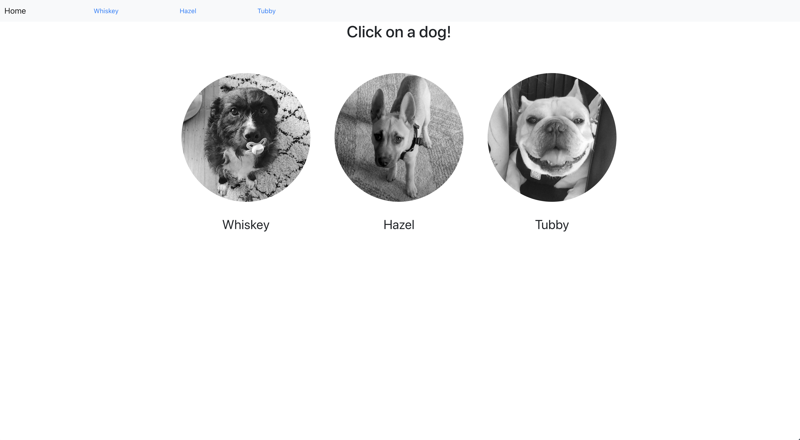
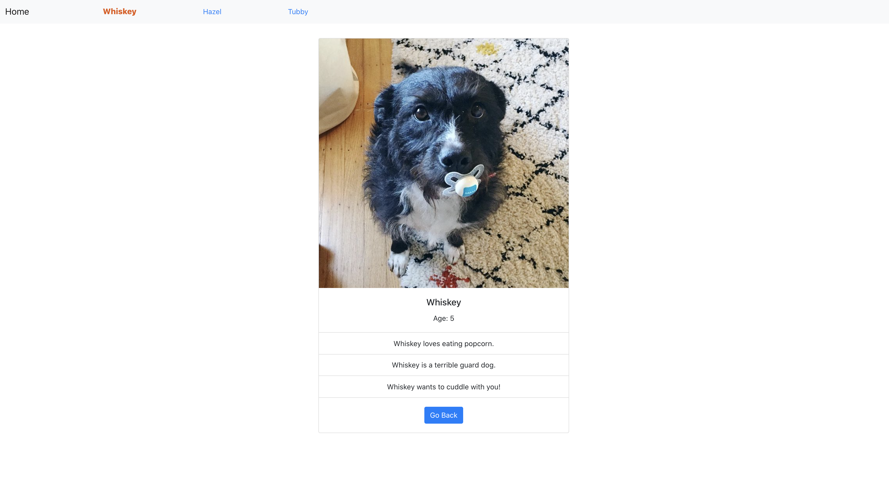

# **React Router Dog Finder**

## Description
This was an exercise from the Udemy course, "The Modern React Bootcamp" by Colt Steele.  This exercise was for educational purposes and was used to practice using React Router and some of its features.  Clicking on the links in the navbar will show more details regarding the dog.

## Screenshots

